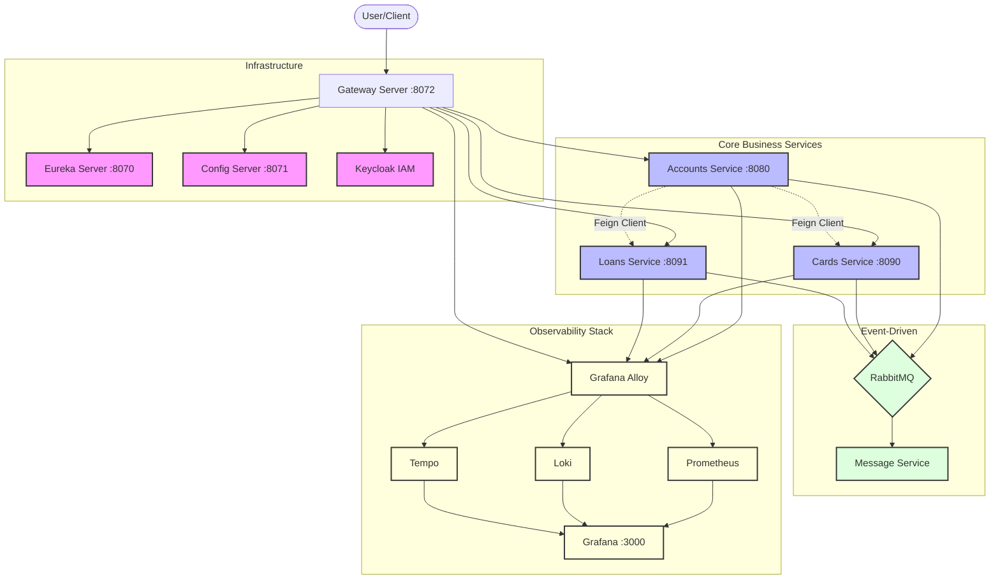

# Bank App Microservices Project

A comprehensive banking microservices ecosystem built with Spring Boot and Spring Cloud, featuring event-driven architecture, centralized configuration, service discovery, API gateway, security, and full observability.

## 🏗️ Architecture Overview

The project follows a distributed microservices architecture where each service is responsible for a specific business domain.



### Core Services
- **Accounts Microservice**: Manages customer account details. Orchestrates data from Cards and Loans services using OpenFeign to provide a consolidated view.
- **Cards Microservice**: Handles credit/debit card management.
- **Loans Microservice**: Manages loan applications and details.
- **Message Microservice**: An event-driven service using Spring Cloud Function and RabbitMQ to handle asynchronous tasks like sending emails and SMS notifications.

### Infrastructure Services
- **Config Server**: Centralized configuration management using Spring Cloud Config.
- **Eureka Server**: Service registration and discovery.
- **Gateway Server**: API Gateway built with Spring Cloud Gateway, handling routing and security.
- **Keycloak**: Identity and Access Management (IAM) for securing the microservices.

## 🛠️ Technology Stack

- **Framework**: Spring Boot 3.x
- **Cloud Components**: Spring Cloud (Config, Eureka, Gateway, OpenFeign, Bus)
- **Database**: MySQL (Separate databases for Accounts, Cards, and Loans)
- **Messaging**: RabbitMQ for asynchronous communication
- **Security**: Spring Security & Keycloak (OAuth2/OIDC)
- **Observability**:
  - **Metrics**: Prometheus & Micrometer
  - **Logs**: Grafana Loki & Grafana Alloy
  - **Tracing**: Grafana Tempo (OpenTelemetry)
  - **Visualization**: Grafana
- **Deployment**: Docker, Docker Compose, Kubernetes

## 🚀 Getting Started

### Prerequisites
- Java 17+
- Maven
- Docker & Docker Desktop

### Running with Docker Compose
1. Navigate to the `docker-compose/default` directory.
2. Run the following command to start all infrastructure and services:
   ```bash
   docker-compose up -d
   ```
3. The services will be available through the Gateway at `http://localhost:8072`.

### Running on Kubernetes
Kubernetes manifests are located in the `/kubernetes` folder. You can apply them to your cluster:
```bash
kubectl apply -f kubernetes/
```

## 📊 Observability

The project is integrated with a full observability stack:
- **Grafana**: `http://localhost:3000` (Dashboards for metrics, logs, and traces)
- **Prometheus**: `http://localhost:9090` (Metrics collection)
- **Loki**: Log aggregation
- **Tempo**: Distributed tracing

## 🔐 Security

API endpoints are secured via Keycloak. To access protected resources, you must obtain a JWT token from Keycloak and include it in the `Authorization: Bearer <token>` header.

## 📬 Contact
**Author**: Yassine ben kacem
**Email**: yassinbenkacem12@gmail.com
**Website**: [www.yassinebenkacem.ma](https://www.yassinebenkacem.ma)
